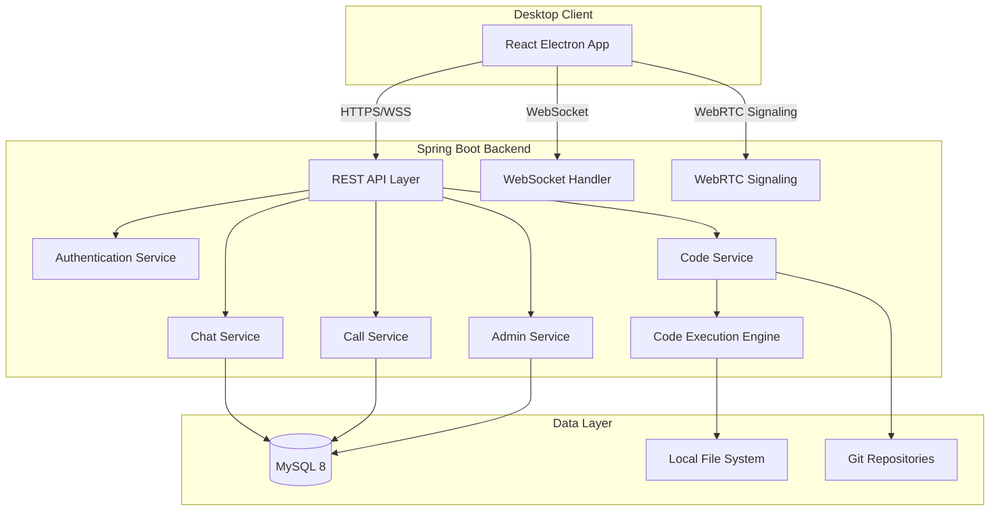
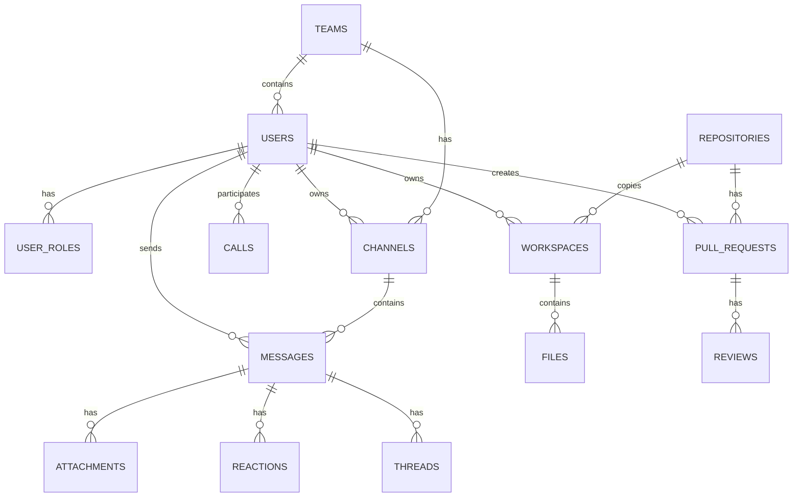

# Enterprise Collaboration Platform - Architecture Overview

## 1. System Overview

### 1.1 Purpose
Build a secure enterprise internal communication and collaboration platform enabling:
- Real-time chat and messaging
- Voice/video calls with screen sharing
- Collaborative code workspace with Monaco Editor
- Code execution in isolated environments
- Code review and approval workflow
- RBAC-based user management

### 1.2 Target Scale
- **Concurrent Users**: 500-1,000 (medium enterprise)
- **Architecture**: Monolithic Spring Boot application
- **Deployment**: Single Linux server (no containers)

---

## 2. High-Level Architecture

### 2.1 Component Diagram



### 2.2 System Modules

| Module | Responsibility |
|--------|----------------|
| **Authentication** | JWT-based auth, bcrypt password hashing, session management |
| **Chat** | Real-time messaging, channels, threads, file attachments |
| **Calls** | WebRTC signaling, room management, screen sharing |
| **Code** | Git repo management, workspace isolation, Monaco integration |
| **Execution** | Sandboxed code execution (Python, Java, Node.js, Go, C++) |
| **Review** | Pull requests, diff viewing, approval workflow |
| **Admin** | User management, team management, license keys, monitoring |

---

## 3. Security Architecture

### 3.1 Authentication Flow
```
User Login → Validate Credentials → Generate JWT → Store in HttpOnly Cookie
```

### 3.2 JWT Structure
- **Header**: Algorithm (HS256)
- **Payload**: userId, username, roles, expiration
- **Signature**: HMAC-SHA256 with server secret

### 3.3 Role-Based Access Control

| Role | Permissions |
|------|-------------|
| **ADMIN** | Full system access, user management, license keys, system config |
| **MANAGER** | Team management, code review approval/rejection |
| **EMPLOYEE** | Chat, calls, code collaboration, submit code for review |

### 3.4 Security Measures
- Password hashing: bcrypt (cost factor 12)
- JWT expiration: 24 hours
- Rate limiting: 100 requests/minute per IP
- CORS: Whitelist desktop client origins
- Audit logging: All sensitive operations logged

---

## 4. Data Architecture

### 4.1 Database Schema Overview



### 4.2 Storage Directory Structure
```
/opt/company-platform/
├── repos/                    # Git repositories
│   ├── {project-id}/
│   │   └── {repo-name}.git
├── user-workspaces/         # Isolated user workspaces
│   ├── {workspace-id}/
│   │   ├── files/
│   │   └── .execution/
├── uploads/                 # File attachments
│   └── {year}/{month}/{day}/
├── recordings/              # Call recordings
│   └── {call-id}/
└── logs/                    # Application logs
    └── application.log
```

---

## 5. API Architecture

### 5.1 REST API Endpoints

| Prefix | Module | Description |
|--------|--------|-------------|
| `/api/auth` | Auth | Login, logout, refresh token |
| `/api/users` | Users | User CRUD, profile |
| `/api/teams` | Teams | Team management |
| `/api/channels` | Chat | Channel CRUD |
| `/api/messages` | Chat | Message CRUD, reactions |
| `/api/calls` | Calls | Call room management |
| `/api/repos` | Code | Repository management |
| `/api/workspaces` | Code | Workspace management |
| `/api/execute` | Execution | Run code |
| `/api/reviews` | Review | Pull request management |
| `/api/admin` | Admin | Admin operations |

### 5.2 WebSocket Topics

| Topic | Description |
|-------|-------------|
| `/topic/chat/{channelId}` | Channel messages |
| `/topic/dm/{userId}` | Direct messages |
| `/topic/call/{roomId}` | Call signaling |
| `/topic/presence` | User presence updates |

---

## 6. Code Execution Architecture

### 6.1 Execution Flow
```
User Submit Code → Create Temp Directory → Run in Isolated Process → 
Capture Output → Return Result → Cleanup
```

### 6.2 Language Support & Isolation

| Language | Command | Timeout | Memory Limit |
|----------|---------|---------|---------------|
| Python | `python3` | 30s | 512MB |
| Java | `java Main.java` | 30s | 512MB |
| Node.js | `node script.js` | 30s | 512MB |
| Go | `go run main.go` | 30s | 512MB |
| C++ | `g++ && ./a.out` | 30s | 512MB |

### 6.3 Security Restrictions
- No network access from execution
- Restricted file system access
- Process timeout enforcement
- Memory limit enforcement

---

## 7. Desktop Client Architecture

### 7.1 Technology Stack
- **Framework**: Electron 28+
- **UI**: React 18+ with TypeScript
- **State Management**: Zustand
- **Code Editor**: Monaco Editor
- **WebRTC**: simple-peer
- **Build Tool**: Vite + electron-builder

### 7.2 Client Modules

| Module | Description |
|--------|-------------|
| **ChatView** | Message list, input, channel sidebar |
| **CallView** | Video grid, controls, screen share |
| **EditorView** | Monaco editor, file tree, terminals |
| **WorkspaceManager** | Project selection, workspace switch |
| **NotificationManager** | Desktop notifications |
| **AuthManager** | Login, session handling |

---

## 8. Deployment Architecture

### 8.1 Server Requirements
- **OS**: Ubuntu 22.04 LTS / RHEL 9
- **CPU**: 8 cores
- **RAM**: 16GB
- **Storage**: 500GB SSD
- **Java**: OpenJDK 21
- **MySQL**: 8.0

### 8.2 Systemd Service
```
[Unit]
Description=Enterprise Collaboration Platform
After=network.target mysql.service

[Service]
Type=simple
User=enterprise
WorkingDirectory=/opt/company-platform
ExecStart=/usr/bin/java -jar enterprise-collab.jar
Restart=always

[Install]
WantedBy=multi-user.target
```

---

## 9. Scalability Considerations

### 9.1 Current Optimizations
- Connection pooling (HikariCP)
- WebSocket session management
- Lazy loading for repositories
- Pagination for messages

### 9.2 Future Scaling (if needed)
- Read replicas for MySQL
- Redis for session/presence
- CDN for static assets
- Horizontal scaling with load balancer
